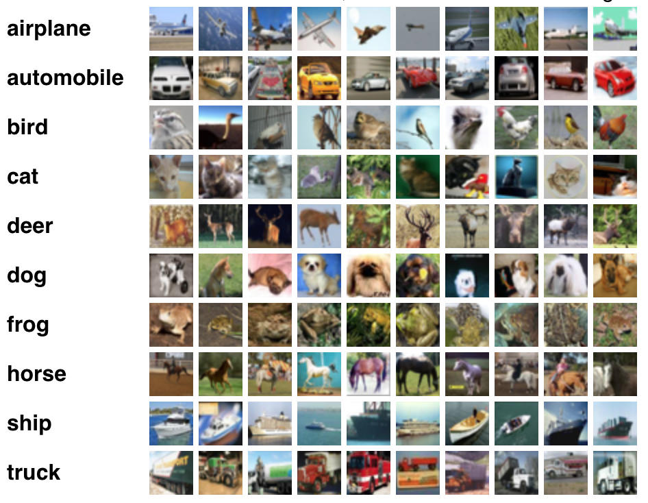
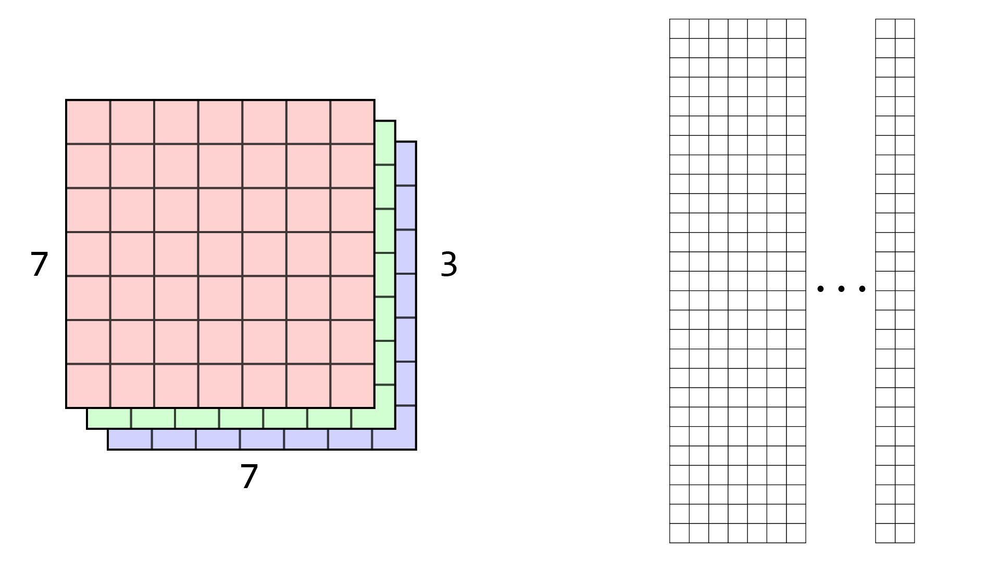
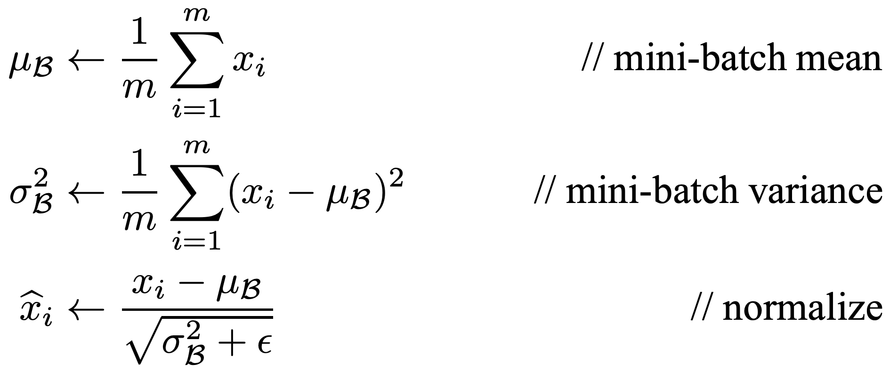
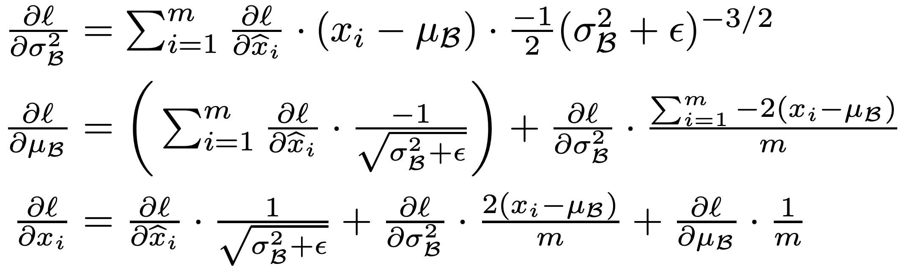

# CSE 490g1 / 599g1 Homework 0 #

Welcome friends,

For the first assignment we'll be diving right in to neural networks. What are they? How do they work? Do they really require blood sacrifices on the third Saturday of odd-numbered months? We'll find out the answers to these questions and more!

## What the heck is this codebase?? ##

During this class you'll be building out your own neural network framework. I'll take care of some of the more boring parts like loading data, stringing things together, etc. so you can focus on the important parts.

Those of you who took vision with me will recognize a lot of the image codebase as stuff that you did! Early on we'll be focussing on applications of deep learning to problems in computer vision so there's a lot of code in `image.c` for loading images and performing some basic operations. No need to go into the details, just glance through `image.h` for a quick summary of the kinds of operations you can perform on images. We won't need any of that for this homework though!

More pertinent to this homework is the matrix library described in `matrix.h` and fleshed out in `matrix.c`. As we've learned in class, the heavy lifting in deep learning is done through matrix operations. The important ones we'll be using today are matrix multiplication and an elementwise scaled addition called `axpy` (for ax + y). But to warm up we'll do some easy stuff. Let's get crackin!

Remember, the codebase is in C. There is a `Makefile` but every time you make a change to the code you have to run `make` for your executable to be updated.

## 1. Matrices ##

If you check out `matrix.h` you see that our matrices are pretty simple, just a size in `rows` and `cols` and a field for the data. Now check out `matrix.c` and read through the functions for making new (zeroed out) matrices and randomly filled matrices.

### 1.1 `copy_matrix` ###

Fill in the code for making a copy of a matrix. We've already created the new matrix for you, you just have to fill it in!

### 1.2 `transpose_matrix` ###

Fill in the code to transpose a matrix. First make sure the matrix is the right size. Then fill it in. This might be handy: https://en.wikipedia.org/wiki/Transpose

### 1.3 `axpy_matrix` ###

Fill in the code to perform the weighted sum. The operation you are performing is `y = ax + y`, element-wise over the matrices. This means the matrices should be the same size!

### 1.4 `matmul` ###

Implement matrix multiplication. No need to do anything crazy, 3 `for` loops oughta do it. However, good cache utilization will make your operation much faster! Once you've written something you can run: `./uwnet test`. This doesn't actually check if your code is correct but it will time a bunch of matrix multiplications for you. Try optimizing your loop ordering to get the fastest time. You don't need to change anything except the loop order, there's just one ordering that's MUCH faster. On this test for my code it takes about 4 seconds but your processing speed may vary!

## 2. Activation functions ##

An important part of machine learning, be it linear classifiers or neural networks, is the activation function you use. We'll define our activation functions in `activations.c`. This is also a good time to check out `uwnet.h`, which gives you an overview of the structures will be using for building our models and, important for this, what activation functions we have available to us!

### 2.1 `activate_matrix` ###

Fill in `void activate_matrix(matrix m, ACTIVATION a)` to modify `m` to be `f(m)` applied elementwise where the function `f` is given by what the activation `a` is.

Remember that for our softmax activation we will take e^x for every element x, but then we have to normalize each element by the sum as well. Each row in the matrix is a separate data point so we want to normalize over each data point separately.

### 2.2 `gradient_matrix` ###

As we are calculating the partial derivatives for the weights of our model we have to remember to factor in the gradient from our activation function at every layer. We will have the derivative of the loss with respect to the output of a layer (after activation) and we need the derivative of the loss with respect to the input (before activation). To do that we take each element in our delta (the partial derivative) and multiply it by the gradient of our activation function.

Normally, to calculate `f'(x)` we would need to remember what the input to the function, `x`, was. However, all of our activation functions have the nice property that we can calculate the gradient `f'(x)` only with the output `f(x)`. This means we have to remember less stuff when running our model.

The gradient of a linear activation is just 1 everywhere. The gradient of our softmax will also be 1 everywhere because we will only use the softmax as our output with a cross-entropy loss function, for an explaination of why see [here](https://math.stackexchange.com/questions/945871/derivative-of-softmax-loss-function?utm_medium=organic&utm_source=google_rich_qa&utm_campaign=google_rich_qa) or [here](https://eli.thegreenplace.net/2016/the-softmax-function-and-its-derivative/#softmax-and-cross-entropy-loss).

The gradient of our logistic function is discussed [here](https://en.wikipedia.org/wiki/Logistic_function#Derivative):

    f'(x) = f(x) * (1 - f(x))

I'll let you figure out on your own what `f'(x)` given `f(x)` is for RELU and Leaky RELU.

As discussed in the backpropagation slides, we just multiply our partial derivative by `f'(x)` to backpropagate through an activation function. Fill in `void gradient_matrix(matrix m, ACTIVATION a, matrix d)` to multiply the elements of `d` by the correct gradient information where `m` is the output of a layer that uses `a` as it's activation function.

## 3. Connected Layers ##

For this homework we'll be implementing a fully connected neural network layer as our first layer type! This should be fairly straightforward. First let's check out our layer definition in `src/uwnet.h`:

    typedef struct layer {
        matrix *in;     // Holds the most recent input matrix
        matrix *out;    // The most recent output matrix
        matrix *delta;  // The error made by this layer

        // Weights
        matrix w;
        matrix dw;

        // Biases
        matrix b;
        matrix db;

        ACTIVATION activation;
        LAYER_TYPE type;
        matrix  (*forward)  (struct layer, struct matrix);
        void   (*backward) (struct layer, struct matrix);
        void   (*update)   (struct layer, float rate, float momentum, float decay);
    } layer;

We have pointers to matrices that will hold the input and output to our layer. We also have a matrix that will store the error made by the layer on the most recent run, `delta`.

### 3.1 `forward_connected_layer` ###

Our layer outputs a matrix called `out` as `f(in*w + b)` where: `in` is the input, `w` is the weights, `b` is the bias, and `f` is the activation function.

To compute the output of the model we first will want to do a matrix multiplication involving the input and the weights for that layer. Remember, the weights are stored under `l.w`.

Then we'll want to add in our biases for that layer, stored under `l.b`. The function `forward_bias` may come in handy here!

Finally, we'll want to activate the output with the activation function for that layer.

### 3.2 `backward_connected_layer` ###

This is the trickiest one probably.

To update our model we want to calculate `dL/dw` and `dL/db`.

We also want to calculate the deltas for the previous layer (aka the input to this layer) which is `dL/din`.

What we have to start with is `dL/dout`, stored in `delta`, which is equivalent to `dL/df(in*w+b)`.

We need to calculate `dL/d(in*w+b)` which is `dL/df(in*w+b) * df(in*w+b)/d(in*w+b)`. This is exactly what our `gradient_matrix` function is for!

First we need `dL/db` to calculate our bias updates. Actually, you can show pretty easily that `dL/db = dL/d(in*w+b)` so we're almost there. Except we have bias deltas for every example in our batch. So we just need to sum up the deltas for each specific bias term over all the examples in our batch to get our final `dL/db`, this can be done and added straight into our currently stored `db` term using the `backward_bias` function.

Then we need to get `dL/d(in*w)` which by the same logic as above we already have as `dL/d(in*w+b)`. So taking our `dL/d(in*w)` we can calculate `dL/dw` and `dL/din` as described in lecture. Good luck!

### 3.3 `update_connected_layer` ###

We want to update our weights using SGD with momentum and weight decay.

Our normal SGD update with learning rate η is:

    w = w + η*dL/dw

With weight decay λ we get:

    w = w + η*(dL/dw - λw)

With momentum we first calculate the amount we'll change by as a scalar of our previous change to the weights plus our gradient and weight decay:
    
    Δw = m*Δw_{prev} + dL/dw - λw

Then we apply that change:
    
    w = w + η*Δw

In our case, we'll always try to keep track of Δw in our layer's `l.dw`. When we start the update method, our `l.dw` will store:

    l.dw = m*Δw_{prev} + dL/dw

`m*Δw_{prev}` will come from the last updates we applied, and we added on `dw` during the backward computation. Our first step is to subtract off the weight decay (using axpy) so we have:

    l.dw = m*Δw_{prev} + dL/dw - λw

This is the same as the weight updates we want to make, `Δw`. Next we need to add a scaled version of this into our current weights (also using axpy).

Before we applied the updates, `l.dw = Δw`, but after we apply them, `l.dw = Δw_{prev}`. Thus our final step is to scale this vector by our momentum term so that:

    l.dw = m*Δw_{prev}

Then during our next backward phase we are ready to add in some new `dL/dw`s!

## 4. Training your network! ##

First check out `net.c` to see how we run the network forward, backward, and updates. It's pretty simple.

Now, little did you know, but our C library has a Python API all ready to go! The API is defined in `uwnet.py`, but you don't have to worry about it too much. Mainly, check out `trymnist.py` for an example of how to train on the MNIST data set. But wait, you don't have any data yet!

### 4.1 Get MNIST data ###

Background: MNIST is a classic computer vision dataset of hand-drawn digits - http://yann.lecun.com/exdb/mnist/

I already have it all ready to go for you, just run:

    wget https://pjreddie.com/media/files/mnist.tar.gz
    tar xvzf mnist.tar.gz

### 4.2 Train a model ###

Make sure your executable and libraries are up to date by running:

    make

Then try training a model on MNIST!

    python trymnist.py

Every batch the model will print out the loss and at the end of training your model will run on the training and testing data and give you final accuracy results. Try playing around with different model structures and hyperparameter values. Can you get >97% accuracy?

### 4.3 Train on CIFAR ###

The CIFAR-10 dataset is similar in size to MNIST but much more challenging - https://www.cs.toronto.edu/~kriz/cifar.html. Instead of classifying digits, you will train a classifier to recognize these objects:

First get the dataset:

    wget https://pjreddie.com/media/files/cifar.tar.gz
    tar xvzf cifar.tar.gz

Then try training on CIFAR:

    python trycifar.py

How do your results compare to MNIST? If you changed your model for MNIST, do similar changes affect your CIFAR results in the same way?

## 5. Running on the GPU with PyTorch ##

Navigate to: https://colab.research.google.com/

and upload the iPython notebook provided: `mnist_pytorch.ipynb`

Complete the notebook to train a PyTorch model on the MNIST dataset.

## Turn it in ##

First run the `collate.sh` script by running:

    bash collate.sh
    
This will create the file `submit.tar.gz` in your directory with all the code you need to submit. The command will check to see that your files have changed relative to the version stored in the `git` repository. If it hasn't changed, figure out why, maybe you need to download your ipynb from google?

Submit `submit.tar.gz` in the file upload field for Homework 0 on Canvas.

# CSE 490g1 / 599g1 Homework 1 #

Welcome friends,

For the second assignment we'll be implementing two core building blocks to deep learning, convolutional layers and maxpooling layers.

You'll have to copy over your answers from the previous assignment, `matrix.c`, `activations.c`, and `connected_layer.c`.

## 5. Convolutions ##

In this homework we will implement convolutional layers using the `im2col` method. This technique is not optimal for every situation but it is a simple way to get very efficient convolutions both on CPU and GPU. One downside is that it can only process images one at a time, so we don't get any extra benefit from batch processing. That's fine though. Open up `convolutional_layer.c` and let's get started!

### 5.1 `im2col` ###

As we discussed in lecture, most of our convolution code will be handeled our `im2col` funciton. Check out `forward_convolutional_layer` to see how our layer will be processed using this function. The basic idea is our filters are already stored appropriately in the `l.w` matrix. We simply need to lay out our image correctly so that doing a matrix multiplication results in running the filters over the image.

First, let's start with some assumptions. We assume that we will always use padding for our convolutions, thus a convolutional layer with a stride of 1 will always return a feature map with the same spatial dimensions as the original. For strided convolutions, if the feature map is a multiple of the stride we simply return a feature map that is downsampled by a factor of the stride. If the input size is not divisible by the stride, we err on the side of making the output slightly larger, not smaller.

For example, if we have an input feature map of spatial dimension `7x7`, and a convolutional layer with stride 2 the output will have spatial dimension `4x4`. This is a specific design decision and you could decide other ways to do this, or implement functionality that allows you to control the padding and input/output sizes. However, for this homework, we'll stick to these choices because they make good default behavior.

Your job is to fill in the column matrix with the appropriate values. There are several ways to go about doing this. The most efficient is probably to loop over the matrix elements in order (first the first row with each column sequentially, then the second row, etc), find the appropriate index in the original image, and copy that value over to the column matrix. This gif may help?

This is an example of `im2col` on a `7x7x3` image with filter size of 3 and a stride of 1. Note, the letters aren't meant to convey that the values are the same in each channel of the image, just to help you understand which positional elements map to where in the output.

### 5.2 `col2im` ###

This is going to be very similar to `im2col` but backwards. Also, instead of setting values directly, we will be adding values from the column matrix back into the image. Multiple values from the column matrix will map to the same element in the image so we want to make sure all of them contribute.

### 5.3 `update_convolutional_layer` ###

Now you have to update your convolutional layer! This will be very similar to the update method you wrote for the connected layer. Maybe even exactly the same?

## 6. Maxpooling ##

Maxpooling is another core building block of convolutional neural networks. Implementing maxpooling will be similar to implementing convolutions in some ways, you will have to iterate over the image, process a window of pixels with some fixed size, and in this case find the maximum value to put into the output.

### 6.1 `forward_maxpool_layer` ###

Write the forward method to find the maximum value in a given window size, moving by some strided amount between applications. Note: maxpooling happens on each channel independently.

### 6.2 `backward_maxpool_layer` ###

The backward method will be similar to forward. Even though the window size may be large, only one element contributed to the error in the prediction so we only backpropagate our deltas to a single element in the input per window. Thus, you'll iterate through again and find the maximum value and then backpropagate error to the appropriate element in `prev_delta` corresponding to the position of the maximum element.

## Experiments With Convnets! ##

There are several examples of convnet architectures in `trycifar.py` and `trymnist.py`. Try them out and try a few of your own!

Now, for the unmodified convnet architecture in `trycifar.py`, calculate how many operations it takes to process one forward pass through the network. You only need to worry about the matrix operations since everything else is pretty small compared to them.

Let's assume that we have fused multiply-adds so a matrix multiplication of a `M x K` matrix with a `K x N` matrix takes `M*K*N` operations. How many operations does the convnet use during a forward pass?

Design a fully-connected network that uses the same number of operations and has the same number of layers. Now train this network on CIFAR. What are the comparative accuracies of the two networks? Do convolutions work better than fully-connected layers? Why do you think in this case you see the results you do, what indicators do you have? Put your network configuration and answers to these questions in `trycifar.py`.

## PyTorch Section ##

Upload `homework1_colab.ipynb` to Colab and train some big convolutional networks on real image datasets, like ImageNet! Once you are done with this section make sure you re-download your Python notebook so you can turn it in!

## Turn it in ##

First run the `collate.sh` script by running:

    bash collate.sh
    
This will create the file `submit.tar.gz` in your directory with all the code you need to submit. The command will check to see that your files have changed relative to the version stored in the `git` repository. If it hasn't changed, figure out why, maybe you need to download your ipynb from google?

Submit `submit.tar.gz` in the file upload field for Homework 1 on Canvas.

# CSE 490g1 / 599g1 Homework 2 #

Welcome friends,

For the third assignment we'll be implementing a powerful tool for improving optimization, batch normalization!

You'll have to copy over your answers from the previous assignment.

## 7. Batch Normalization ##

The idea behind [batch normalization](https://arxiv.org/pdf/1502.03167.pdf) is simple: at every layer, before the bias and activation function, we'll normalize the layer output so every neuron has zero mean and unit variance. However, this simple technique provides huge benefits for model stability, convergence, and regularization.

### Batch Norm and Convolutions ###

Batch normalization with fully connected layers is easy. You simply calculate the batch statistics for each neuron and then normalize. With our framework, every row is a different example in a batch and every column is a different neuron so we will calculate statistics for each column and then normalize so that every column has mean 0 and variance 1.

With convolutional layers we are going to normalize the output of a filter over a batch of images. Each filter produces a single channel in the output of a convolutional layer. Thus for batch norm, we are normalizing across a batch of channels in the output. So, for example, we calculate the mean and variance for all the 1st channels across all the examples, all the 2nd channels across all the examples, etc. Another way of thinking about it is we are normalizing the output of a single filter, which gets applied both to all of the examples in a batch but also at numerous spatial locations for every image.

Thus for our batch normalization functions we will be normalizing across rows but also across columns depending on the spatial component of a feature map. Check out `batch_norm.c`, I've already filled in the `mean` example for calculating the mean of a batch.

The `spatial` parameter will tell you how many elements are in a spatial group (i.e. channel) of your output. So, if your convolutional layer outputs a `32 x 32 x 8` image and has a batch size of 128, the matrix `x` will have 128 rows and 8192 columns. We want to calculate a mean for every channel thus our matrix `m` will have 1 row and 8 columns (since there are 8 channels in the output). The images we are processing are `32 x 32` so the `spatial` parameter in this case will be the integer 1024. In a fully connected layer, the `spatial` parameter would always be 1 and we would calculate separate means for each neuron in the output.

### Forward propagation ###

These are the forward propagation equations from the [original paper](https://arxiv.org/abs/1502.03167). Note, we'll just use `x̂` as the output, we'll skip the scaling factor for now and our layers already have a bias component that they will use on their own.

### 7.1 `variance` ###

Fill in the section to compute the variance of a feature map. As in the `mean` computation, we will compute variance for each filter. We need the previously computed `mean` for this computation so it is passed in as a parameter. Remember, variance is just the average squared difference of an element from the mean:

Don't take the square root just yet, that would be standard deviation!

### 7.2 `normalize` ###

To normalize our output, we simply subtract the mean from every element and divide by the standard deviation (now you'll need a square root). When you're dividing by the standard deviation it can be wise to add in a small term (the epsilon in the batchnorm equations) to prevent dividing by zero. Especially if you are using RELUs, you may occassionally have a batch with 0 variance.

### Understanding the forward pass ###

`batch_normalize_forward` shows how we process the forward pass of batch normalization. Mostly we're doing what you'd expect, calculating mean and variance and normalizing with them:

    matrix m = mean(x, spatial);
    matrix v = variance(x, m, spatial);
    
    matrix x_norm = normalize(x, m, v, spatial);

We are also keeping track of a rolling average of our mean and variance. During training or when processing large batches we can calculate means and variances but if we just want to process a single image it can be hard to get good statistics, we have to batch to norm against! Thus if we have a batch size of 1 we normalize using our rolling averages:

    if (x.rows == 1){
        return normalize(x, l.rolling_mean, l.rolling_variance, spatial);
    }

We assume the `l.rolling_mean` and `l.rolling_variance` matrices are initialized when the layer is created. Note that we use them to calculate the `spatial` size of the output.

We also have the matrix pointer `l.x` which will keep track of the input to the batch norm process. We will need to remember this for the backward step!

IMPORTANT: We need to initialize our rolling matrices and `l.x` when we create a convolutional or connected layer. In `make_connected_layer`, add the following lines before the return statement:

    l.x = calloc(1, sizeof(matrix));
    l.rolling_mean = make_matrix(1, outputs);
    l.rolling_variance = make_matrix(1, outputs);

Add similar lines in `make_convolutional_layer`, using the appropriate size for the rolling average matrices.

While we're at it, let's add in the code to run batch normalization if it's enabled for a particular layer. We want to run batchnorm after the inputs have been multiplied by the weights of a layer but before the bias is added and before the activation function is computed. Each layer has the flag `l.batchnorm` that signals whether batch norm should be run for that layer. Add the following code in the appropriate spot in both the connected and convolutional layer code:

    if(l.batchnorm){
        matrix xnorm = batch_normalize_forward(l, out);
        out = xnorm;
    }

### Backward propagation ###

The backward propagation step looks like this:

So to backward propagate we'll need to calculate these intermediate results, ∂l/∂µ and ∂l/∂σ². Then, using them, we can calculate ∂l/∂x̂. Note that the second summation in ∂l/∂µ evaluates to zero. Thus you can leave out the second term and just use the summation involving ∂l/∂x̂.

### 7.3 `delta_mean` ###

Calculate ∂l/∂µ.

### 7.4 `delta_variance` ###

Calculate ∂l/∂σ².

### 7.5 `delta_batch_norm` ###

Using the intermediate results, calculate ∂l/∂x̂.

### Add backward processing to your layers ###

Add this code to the backward processing of the connected and convolutional layers:

    if(l.batchnorm){
        matrix dx = batch_normalize_backward(l, delta);
        free_matrix(delta);
        l.delta[0] = delta = dx;
    }

Think about where you added the forward code. Where should the backward processing step happen?

### 7.6 Using your batchnorm ###

Try out batchnorm! To add it to a layer, just make this simple change:

    make_convolutional_layer(16, 16, 8, 16, 3, 1, LRELU), # No batch norm
    make_convolutional_layer(16, 16, 8, 16, 3, 1, LRELU, 1), # Batch norm!
    make_convolutional_layer(16, 16, 8, 16, 3, 1, LRELU, batchnorm=1), # Also batch norm!

You should be able to add it to convolutional or connected layers. The standard for batch norm is to use it at every layer except the output. First, train the `conv_net` as usual. Then try it with batchnorm. Does it do better??

In class we learned about annealing your learning rate to get better convergence. We ALSO learned that with batch normalization you can use larger learning rates because it's more stable. Increase the starting learning rate to `.1` and train for multiple rounds with successively smaller learning rates. Using just this model, what's the best performance you can get?

## PyTorch Section ##

Upload `homework2_colab.ipynb` to Colab and train a neural language model.

## Turn it in ##

First run the `collate.sh` script by running:

    bash collate.sh
    
This will create the file `submit.tar.gz` in your directory with all the code you need to submit. The command will check to see that your files have changed relative to the version stored in the `git` repository. If it hasn't changed, figure out why, maybe you need to download your ipynb from google?

Submit `submit.tar.gz` in the file upload field for Homework 2 on Canvas.

